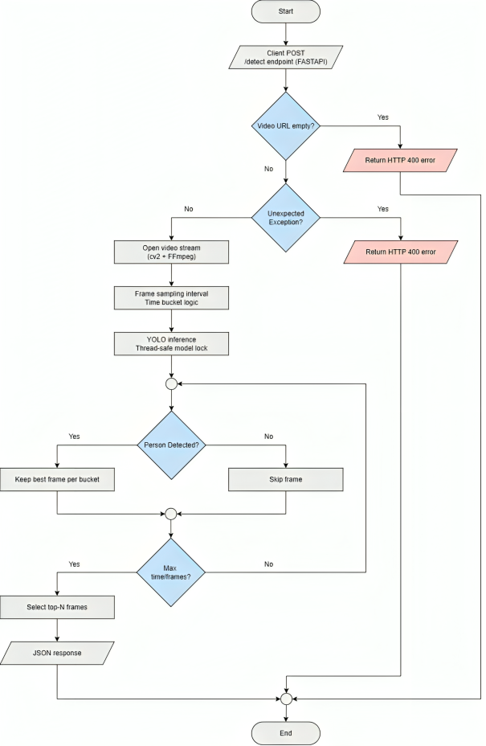

# Person-Detection-NMSAI

Production-ready Person Detection API built with FastAPI and YOLO.  
This service processes video streams, detects persons, and returns the top-N highest confidence frames in Base64 format.  
Optimized for CPU efficiency and concurrent production workloads.

---

## Overview

Person-Detection-NMSAI is a containerized REST API service that:

- Accepts a public video URL or stream URL
- Samples frames efficiently using time-bucket logic
- Runs YOLO-based person detection
- Returns the top-N highest confidence frames
- Applies strict CPU protection limits
- Supports concurrent production workloads

The system is deployed using Gunicorn with multiple Uvicorn workers for production stability.

---

## Key Features

- FastAPI-based REST API
- YOLO model loaded once at startup
- Thread-safe inference using a global model lock
- Frame sampling for CPU efficiency
- Hard caps on processing duration and frame count
- Top-N best frame selection by confidence
- Base64 encoded image output
- Dockerized with Gunicorn + Uvicorn workers
- Designed for safe concurrent deployment

---

## System Architecture



---

## Model Distribution

The production model is distributed via GitHub Release.

Version: `v1.0`  
Model File: `person-x-150.pt`

The application automatically downloads the model at startup if it is not present locally.

---

## Configuration

Defined in `app.py`:

```python
CONF_THRESHOLD = 0.5
INTERVAL_SEC = 1.0
MAX_SHOWN = 3
MAX_VIDEO_SECONDS = 10
MAX_FRAMES = 30
MODEL_PATH = "person-x-150.pt"
```

### Configuration Description

| Variable | Description |
|----------|------------|
| CONF_THRESHOLD | Minimum confidence score required for detection |
| INTERVAL_SEC | Frame sampling interval in seconds |
| MAX_SHOWN | Maximum number of returned frames |
| MAX_VIDEO_SECONDS | Maximum processing duration limit |
| MAX_FRAMES | Hard cap on total processed frames |
| MODEL_PATH | Local path of YOLO model file |

---

## API Specification

### Endpoint

```
POST /detect
```

### Request Body

```json
{
  "video_url": "http://example.com/video.webm"
}
```

### Content-Type

```
application/json
```

---

### Response Example (Person Detected)

```json
{
  "status": "PERSON DETECTED",
  "person_detected": true,
  "max_confidence": 0.9421,
  "total_images": 3,
  "images_base64": [
    "base64_encoded_image_1",
    "base64_encoded_image_2",
    "base64_encoded_image_3"
  ]
}
```

---

### Response Example (No Person Detected)

```json
{
  "status": "CLEAR",
  "person_detected": false,
  "max_confidence": 0.0,
  "total_images": 0,
  "images_base64": []
}
```

---

## Resource Protection Strategy

To ensure CPU safety and production stability:

1. **Frame Sampling**  
   Only one frame per time bucket (`INTERVAL_SEC`) is processed to reduce redundant inference and improve CPU efficiency.

2. **Maximum Duration Limit**  
   Processing automatically stops after `MAX_VIDEO_SECONDS` to prevent long-running video streams from exhausting server resources.

3. **Hard Frame Cap**  
   Processing stops after `MAX_FRAMES`, even if the video continues, ensuring a strict upper bound on CPU usage per request.

4. **Thread-Safe Inference**  
   A global model lock (`threading.Lock`) ensures safe concurrent inference execution when multiple API requests are processed simultaneously.

5. **Top-N Frame Selection**  
   Only the highest-confidence frames (up to `MAX_SHOWN`) are stored and returned in the response to optimize payload size and relevance.

These protections prevent:

- Infinite stream processing
- CPU exhaustion
- Memory overuse
- Model race conditions
- VPS overload under concurrency

---

## Project Structure

```
Person-Detection-NMSAI/
│
├── app.py
├── requirements.txt
├── Dockerfile
├── docker-compose.yml
├── LICENSE
└── README.md
```

---

## Docker Deployment

### Build Image

```bash
docker compose build --no-cache
```

### Run Container

```bash
docker compose up -d
```

API will be available at:

```
http://localhost:8001
```

---

## Technology Stack

- Python 3.10
- FastAPI
- Gunicorn
- Uvicorn
- Ultralytics YOLO
- PyTorch
- OpenCV (Headless)
- NumPy
- Docker
- FFmpeg backend via OpenCV

---

## Versioning

### v1.0
Initial production release including:

- Core video inference pipeline
- YOLO-based person detection
- Automatic model distribution at startup
- Thread-safe global model loading
- Frame sampling and time-bucket logic
- Resource protection limits (duration cap, frame cap)
- Top-N best frame selection by confidence
- Dockerized deployment with Gunicorn + Uvicorn workers

---

## License

Copyright (c) 2026 Eldisja Hadasa

All rights reserved.

This software and associated documentation files (the "Software") are proprietary and confidential.

No part of this Software may be copied, modified, distributed, sublicensed, or used for commercial purposes without explicit written permission from the copyright holder.

Unauthorized use, reproduction, or distribution of this software is strictly prohibited.

---

## Maintainer

**Eldisja Hadasa**

The Enterprise Fleet Tracking IoT Platform implements a containerized IoT telemetry ingestion pipeline using MQTT, FastAPI, PostgreSQL, and Docker.

- GitHub: https://github.com/eldisja1
- LinkedIn: https://www.linkedin.com/in/eldisja-hadasa/